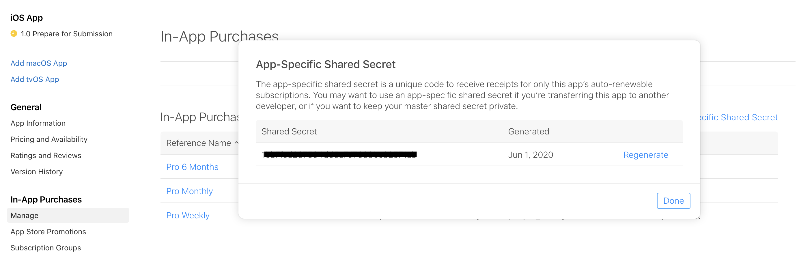

# App Store configuration
In this document I'll show you how to config this package to work with App Store. 

## App Store Password
Apple's App-Specific Shared Secret is a unique key to receive receipts for your app's auto-renewable subscriptions. This key allows you to verify these in-app purchases.

Open the config file `config/purchase.php`, you'll notice a configuration key `appstore_password` which gets its value from the environment variable `APPSTORE_PASSWORD`. You need to update your `.env` file to add the App Store password key and value.

### Generating an App-Specific Secret
1. Log in to [App Store Connect](https://appstoreconnect.apple.com/).
2. Navigate to "My Apps" and select your app.
3. Select "Manage" under the "In-App Purchases" section from the left side menu.
4. Select App-Specific Share Secret from the right side above your in-app products.
5. Generate and copy your shared secret.

